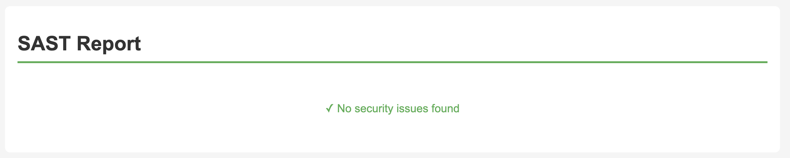
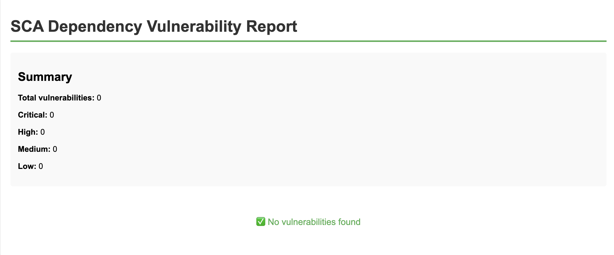

# Информационная безопасность - работа 1

Стек: Node.js + Express

## API

### `POST /auth/login`

Аутентификация пользователя по имени и паролю.
После успешной аутентификации возвращает JWT в теле ответа.

Пример тела запроса

```json
{
  "username": "admin",
  "password": "admin123"
}
```

Пример тела ответа

```json
{
  "message": "Login successful",
  "token": "<jwt>"
}
```

### `GET /api/data`

Получение данных.
Для доступа требуется наличие заголовка `Authorization` с валидным JWT.

Пример заголовка `Authorization`

```
Authorization: Bearer <jwt>
```

Пример тела ответа

```json
{
  "message": "Data retrieved successfully",
  "data": [
    {
      "id": 1,
      "title": "Item 1",
      "description": "First item description",
      "createdAt": "2024-01-01T00:00:00Z"
    },
    {
      "id": 2,
      "title": "Item 2",
      "description": "Second item description",
      "createdAt": "2024-01-02T00:00:00Z"
    }
  ]
}
```

### `DELETE /api/data/:id`

Удаление элемента по ID.
Для доступа требуется наличие заголовка `Authorization` с валидным JWT.

Пример заголовка `Authorization`

```
Authorization: Bearer <jwt>
```

Пример тела ответа

```json
{
  "message": "Item deleted successfully",
  "deletedItem": {
    "id": 1,
    "title": "Item 1",
    "description": "First item description",
    "createdAt": "2024-01-01T00:00:00Z"
  }
}
```

## Базовые меры защиты

### Защита от SQLi (SQL-инъекций)

Используется JSON файл для хранения данных, не SQL база данных.
Если бы использовалась SQL база - применялись бы параметризованные запросы через ORM.

```javascript
const itemsData = await fs.readFile(itemsPath, 'utf8');
const items = JSON.parse(itemsData);
```

### Защита от XSS

Пользовательский ввод экранируется с помощью библиотеки `escape-html`.

```javascript
const escapeHtml = require('escape-html');

function sanitizeObject(obj) {
  if (typeof obj === 'string') {
    return escapeHtml(obj);
  }
  if (Array.isArray(obj)) {
    return obj.map((item) => sanitizeObject(item));
  }
  if (obj && typeof obj === 'object') {
    const sanitized = {};
    for (const key in obj) {
      if (obj.hasOwnProperty(key)) {
        sanitized[key] = sanitizeObject(obj[key]);
      }
    }
    return sanitized;
  }
  return obj;
}
```

### Защита от Broken Authentication

- Реализована выдача JWT при успешной аутентификации
- Реализован middleware `authenticateToken` для проверки JWT в заголовке Authorization
- Сконфигурирована защита маршрутов `/api/**` с помощью реализованного middleware
- Сконфигурировано хеширование паролей с помощью `bcrypt`

```javascript
function authenticateToken(req, res, next) {
  const authHeader = req.headers['authorization'];
  const token = authHeader && authHeader.split(' ')[1];

  if (!token) {
    return res.status(401).json({ error: 'Access token required' });
  }

  jwt.verify(token, JWT_SECRET, (err, user) => {
    if (err) {
      return res.status(403).json({ error: 'Invalid or expired token' });
    }
    req.user = user;
    next();
  });
}

const bcrypt = require('bcrypt');
const hashedPassword = await bcrypt.hash(password, 10);
const isValid = await bcrypt.compare(password, hash);
```

## CI/CD

### Настройка CI/CD

Настроен workflow `ci.yml` для GitHub Actions,
запускающийся при каждом push или pull request в ветку main,
в котором происходит установка зависимостей, запуск анализаторов безопасности и публикация отчетов.
Ссылки на опубликованные отчеты находятся в Summary пайплайна.
Также можно скачать архивы с отчетами из артефактов пайплайна.

### SAST (Static Application Security Testing)

Для статического анализа кода используется `Snyk test`.



### SCA (Software Composition Analysis)

Для проверки зависимостей на известные уязвимости используется `Snyk test`.


